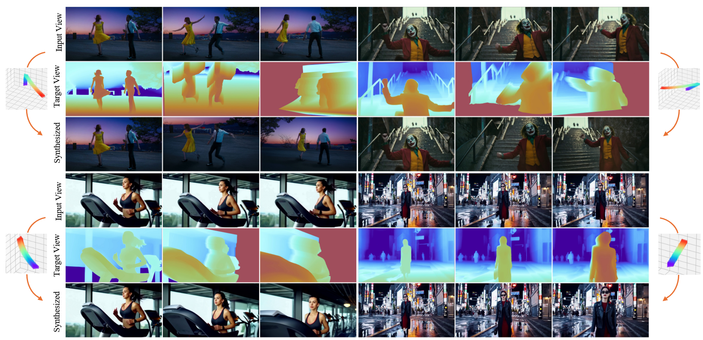
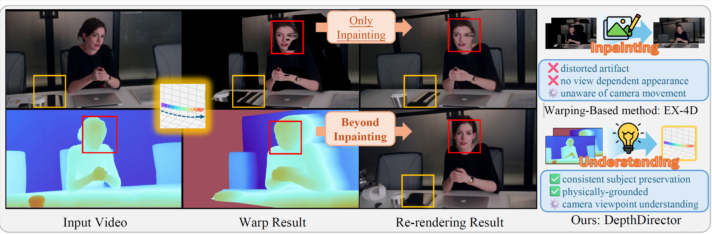
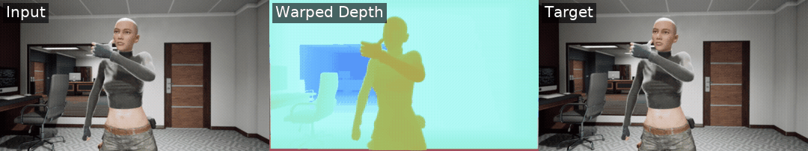

# 🎬 DepthDirector

<h2 align="center"> <a href="https://eleanor6725.github.io/DepthDirector/">[ECCV 2026] Beyond Inpainting: Unleash 3D Understanding for Stable Camera-Controlled Video Re-rendering </a></h2>

<h4 align="center">

[](https://arxiv.org/abs/2601.10214)
[](https://eleanor6725.github.io/DepthDirector/)
[](https://eccv.ecva.net/)

<p align="center">
    
</p>

</h4>

---

## 💡 Overview

**DepthDirector** is a video re-rendering framework that achieves both precise camera controllability and 3D-consistent content preservation.

We identify the **Inpainting Trap** — a shortcut in video diffusion models (VDMs) where warped RGB guidance causes the network to bypass 3D/4D world understanding and act as a naive video inpainter. This leads to two fundamental artifacts: *distortion* from inaccurate monocular geometry, and *baked-in appearance* that prevents the model from handling view-dependent effects.

Our key insight is to **decompose** the conditional injection of video content and camera trajectories via a **View-Content Dual-Stream Condition** mechanism:
- **View Stream** — injects temporally consistent warped depth sequences, rendered from explicit 3D representations under the target view, providing camera guidance *without* appearance leakage.
- **Content Stream** — injects the source video to faithfully preserve scene structure, semantics, dynamic motions, and intrinsic properties.

This decomposition forces the network to resolve novel-view extrapolation from its own understanding of video content and camera movements, achieving stable camera control and consistent content preservation **beyond inpainting**.

<p align="center">
    
</p>

---

## ⚙️ Installation

Ensure you have `torch` and `cuda` installed, then set up the package:

```bash
# Clone the repository
git clone https://github.com/FREDZEL2020/DepthDirector.git
cd DepthDirector
pip install torch==2.9.0 torchvision==0.24.0 --index-url https://download.pytorch.org/whl/cu128
# Install dependencies
pip install -e .
pip install --no-build-isolation git+https://github.com/NVlabs/nvdiffrast.git
```

---

## 📥 Model Checkpoints

Download the pretrained weights and place them in the `checkpoints` directory:

| Model | Link | Path |
| --- | --- | --- |
| **DepthDirector** | [HuggingFace](https://huggingface.co/Fred24/DepthDirector/tree/main) | `checkpoints/depthdirector/step-10000.safetensors` |

Also, download the required third-party model checkpoints:

```bash
huggingface-cli download yyfz233/Pi3X --local-dir checkpoints/yyfz233/Pi3X
huggingface-cli download Salesforce/blip2-opt-2.7b --local-dir checkpoints/Salesforce/blip2-opt-2.7b
huggingface-cli download Wan-AI/Wan2.2-TI2V-5B --local-dir models/Wan-AI/Wan2.2-TI2V-5B
```

Your directory structure should look like this:

```
checkpoints/
├── Salesforce/
│   └── blip2-opt-2.7b
├── depthdirector/
│   └── step-10000.safetensors
└── yyfz233/
    └── Pi3X
models/
└── Wan-AI/
    └── Wan2.2-TI2V-5B
```

---

## 🚀 Usage

### 1. Quick Inference

Try the preprocessed example at `assets/examples/preprocess/anne/`. Inference runs on a single NVIDIA GPU with 32G VRAM using `--cpu_offload`. Disable `--cpu_offload` to reduce inference time if you have 40G+ VRAM.

```bash
bash scripts/test.sh configs/depthdirector.yaml step-10000 assets/examples/preprocess/anne/metadata_test_all.csv
```

### 2. Run on a Custom Video

To process a custom video with a specific camera trajectory (e.g., a 30-degree rotation), run the following steps:

**Step 1: Preprocess the video**

```bash
python tools/recam/inference.py \
    --video_path assets/examples/anne.mp4 \
    --out_dir assets/examples/preprocess/anne \
    --video_length 81 \
    --depth_model Pi3X \
    --task process \
    --traj_txt Rotate,0,30,0,0,0
```

**Step 2: Generate captions**

```bash
python tools/recam/captioner.py \
    --root_path assets/examples/preprocess/anne \
    --task process \
    --dataset test_all
```

**Step 3: Run inference**

```bash
bash scripts/test.sh configs/depthdirector.yaml step-10000 assets/examples/preprocess/anne/metadata_test_all.csv
```

> **Note:** For advanced preprocessing options (different depth estimators, explicit geometries, camera trajectories, etc.), please refer to [tools/recam/README.md](tools/recam/README.md).

---

## 🛠️ Training

We provide scripts for training on custom datasets. First, follow the preprocessing steps in [tools/recam/README.md](tools/recam/README.md), then run:

```bash
bash scripts/train.sh configs/depthdirector.yaml
```

---

## 🗃️ Dataset Generation

We release the full dataset generation pipeline used to construct the **MultiCamWarp Dataset** — 8K synchronized multi-view video sequences rendered from 1K dynamic scenes in Unreal Engine 5. Each sequence provides ground-truth depth maps and calibrated multi-camera views, enabling the model to learn 3D consistency and camera controllability with significantly lower training cost than prior work.

<p align="center">
  
</p>

The dataset is publicly available on HuggingFace: **[Fred24/MultiCamWarp](https://huggingface.co/datasets/Fred24/MultiCamWarp)**. We provide the training video sequences along with an example subset of the Unreal Engine scene and character assets required to run the rendering pipeline. Additional scenes and characters can be downloaded from [fab.com](https://www.fab.com/).

The pipeline (located in [`tools/UnrealRendering/`](tools/UnrealRendering/README.md)) works as follows:

1. **Render** — Unreal Engine 5 renders dynamic scenes headlessly via a Redis task queue, producing synchronized EXR/JPG frame sequences with ground-truth depth across multiple camera viewpoints.
2. **Post-process** — The [recam](tools/recam/README.md) pipeline constructs 3D geometry, and warps frames under novel camera trajectories to produce the View Stream conditions used during training.

For detailed setup and usage, see [tools/UnrealRendering/README.md](tools/UnrealRendering/README.md).

---

## 🔗 Citation

If you find DepthDirector useful for your research, please cite:

```bibtex
@InProceedings{depthdirector,
author="Chen, Dong-Yu
and Guo, Yixin
and Yang, Shuojin
and Mu, Tai-Jiang
and Hu, Shi-Min",
title="Beyond Inpainting: Unleash 3D Understanding for Stable Camera-Controlled Video Re-Rendering",
booktitle="Computer Vision -- ECCV 2026",
year="2026",
pages="148--166",
}
```
